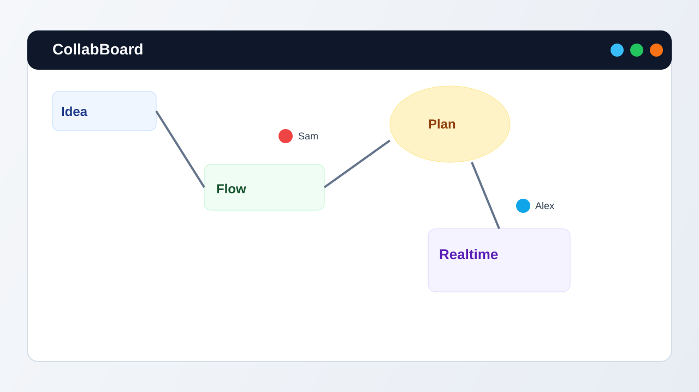

# CollabBoard

CollabBoard is a real-time collaborative whiteboard built with Next.js, Liveblocks, Tldraw, and Convex.

## Preview



## Features

- Create a board and get a shareable URL
- Join a board with no account
- Real-time canvas collaboration
- Live cursor presence with display names
- Board metadata persistence in Convex

## Tech stack

- Next.js 16 (App Router) + TypeScript
- Tldraw for whiteboard rendering and tools
- Liveblocks for real-time presence and room storage
- Convex for board metadata (`boards` table) and API functions
- Vercel for deployment

## Architecture

```text
Browser (Next.js + Tldraw UI)
  -> /api/boards + /api/boards/:boardId (server routes)
  -> /api/liveblocks-auth (token issuance)
  -> Convex (boards metadata)
  -> Liveblocks (room presence + storage sync)
```

## Required accounts and services

- Liveblocks project (public + secret keys)
- Convex project/deployment URL
- Node.js 20+
- pnpm 9+

## Quick start

1. Install dependencies.

```bash
pnpm install
```

2. Configure environment variables.

```bash
cp .env.example .env.local
```

3. Initialize or sync Convex deployment metadata/functions.

```bash
pnpm convex:once
```

4. Start the app.

```bash
pnpm dev
```

Open [http://localhost:3000](http://localhost:3000).

## Environment variables

- `LIVEBLOCKS_SECRET_KEY`
- `NEXT_PUBLIC_LIVEBLOCKS_PUBLIC_KEY`
- `NEXT_PUBLIC_CONVEX_URL`
- `NEXT_PUBLIC_CONVEX_SITE_URL` (generated by Convex CLI for site/action compatibility)

The app validates env configuration on startup and fails fast if values are missing or invalid.

## API endpoints

- `POST /api/boards`
  - Request body: `{ "title": string, "creatorName": string }`
  - Response body: `{ "boardId": string, "roomId": string, "title": string, "createdAt": string }`
- `GET /api/boards/:boardId`
  - Response body: `{ "boardId": string, "roomId": string, "title": string, "creatorName": string, "createdAt": string }`
- `POST /api/liveblocks-auth`
  - Request body: `{ "roomId": string, "displayName": string, "color": string }`
  - Response body: Liveblocks auth token payload

## Development and quality

Run all local quality gates:

```bash
pnpm check
```

Or run individually:

```bash
pnpm typecheck
pnpm lint
pnpm test
pnpm test:e2e
```

## Contributing

See [CONTRIBUTING.md](./CONTRIBUTING.md) for setup details, development flow, and pull request expectations.

## First PR checklist

1. Fork and clone the repository.
2. Run `pnpm install`.
3. Copy `.env.example` to `.env.local` and add valid credentials.
4. Run `pnpm convex:once`.
5. Create a branch and implement your change.
6. Run `pnpm check`.
7. Open a pull request using the template.

## Roadmap

- Add board ownership and access control
- Add board list/search for authenticated users
- Add export/import for board snapshots
- Add usage analytics and rate limiting on API routes

## Security

Please report vulnerabilities through the process in [SECURITY.md](./SECURITY.md).

## License

This project is licensed under the MIT License. See [LICENSE](./LICENSE).
